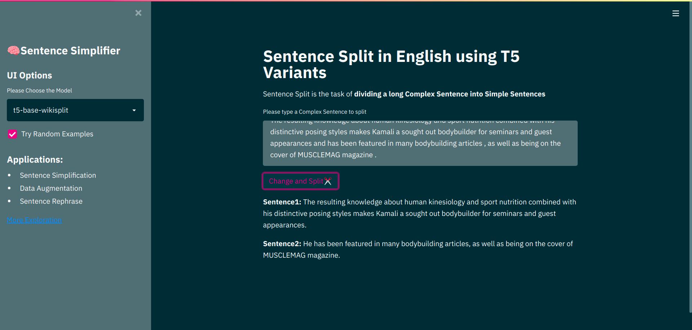
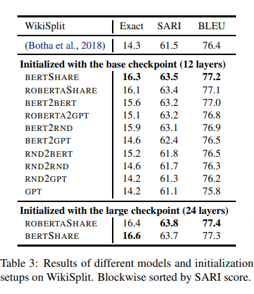

# T5 for Sentence Split in English:

Sentence Split is task of dividing complex sentence in two simple sentences
ex. complex sentence
```
Mary likes to play football in her freetime whenever she meets with her friends that are very nice people.
```
can be divided in
```
Mary likes to play football in her freetime whenever she meets with her friends.
```
and
```
Her friends are very nice people.
```

## Goal:
To make best sentence split model available till now

## Demo:

[try-inference](https://huggingface.co/spaces/flax-community/SentenceSimplifier)

## How to use in your python code:
```python
from transformers import AutoTokenizer, AutoModelForSeq2SeqLM
tokenizer = AutoTokenizer.from_pretrained("flax-community/t5-base-wikisplit")
model = AutoModelForSeq2SeqLM.from_pretrained("flax-community/t5-base-wikisplit")

complex_sentence = "This comedy drama is produced by Tidy , the company she co-founded in 2008 with her husband David Peet , who is managing director ."
sample_tokenized = tokenizer(complex_sentence, return_tensors="pt")

answer = model.generate(sample_tokenized['input_ids'], attention_mask = sample_tokenized['attention_mask'], max_length=256, num_beams=5)
gene_sentence = tokenizer.decode(answer[0], skip_special_tokens=True)
gene_sentence

"""
Output:
This comedy drama is produced by Tidy. She co-founded Tidy in 2008 with her husband David Peet, who is managing director.
"""
```

## Application:
* Sentence Simplification
* Data Augmentation
* Sentence Rephrase

## Current Basline from [paper](https://arxiv.org/abs/1907.12461)


## Our Results:

| Model | Exact | SARI | BLEU |
| --- | --- | --- | --- |
| [t5-base-wikisplit](https://huggingface.co/flax-community/t5-base-wikisplit) |  17.93 | 67.5438 | 76.9 |
| [t5-v1_1-base-wikisplit](https://huggingface.co/flax-community/t5-v1_1-base-wikisplit) | 18.1207 | 67.4873 | 76.9478 |
| [byt5-base-wikisplit](https://huggingface.co/flax-community/byt5-base-wikisplit) | 11.3582 | 67.2685 | 73.1682 |
| [t5-large-wikisplit](https://huggingface.co/flax-community/t5-large-wikisplit) | 18.6632 | 68.0501 | 77.1881 |

## Accomplishment:

* All of our models are having better result for two metrics(Exact and SARI scores) than baseline models
* Our t5-base-wikisplit and t5-v1_1-base-wikisplit model are achieving comparative results with half model size or weights that will enable faster inferece
* We added [wikisplit](https://huggingface.co/metrics/wiki_split) metrics which is freely available at huggingface datasets. It will help future researcher and practioner in this task

## To Do
- [x] [t5-base](https://huggingface.co/t5-base) training on Wiki Split
- [x] [t5-v1_1-base](https://huggingface.co/google/t5-v1_1-base) training on Wiki Split
- [x] [byt5-base](https://huggingface.co/google/byt5-base) training on Wiki Split
- [x] [t5-large](https://huggingface.co/t5-large) training on Wiki Split
- [x] Streamlit UI for App
- [x] Single Websplit Evaluation Metrics Addition in Huggingface Datasets 
- [x] Challenge: Get better performance than [roberta2roberta_L-24_wikisplit](https://huggingface.co/google/roberta2roberta_L-24_wikisplit)
- [x] Performance improvement with Research
- [ ] Tackle Gender Biasness while text generation
- [ ] Benchmarking and Experimenting with Web Split
