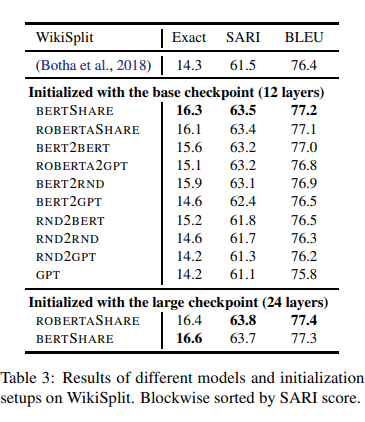

# T5 for Sentence Split in English:

Sentence Split is task of dividing complex sentence in two simple sentences
ex. complex sentence
```
Mary likes to play football in her freetime whenever she meets with her friends that are very nice people.
```
can be divided in
```
Mary likes to play football in her freetime whenever she meets with her friends.
```
and
```
Her friends are very nice people.
```

## Current Basline from [paper](https://arxiv.org/abs/1907.12461)


## Our Results:
| Model | Exact | SARI | BLEU |
| --- | --- | --- | --- |
| [t5-base-wikisplit](https://huggingface.co/flax-community/t5-base-wikisplit) |  17.93 | 67.5438 | 76.9 |
| [t5-v1_1-base-wikisplit](https://huggingface.co/flax-community/t5-v1_1-base-wikisplit) | 16.84 | 66.38 | 76.32 |
| [byt5-base-wikisplit](https://huggingface.co/flax-community/byt5-base-wikisplit) | 11.3582 | 67.2685 | 73.1682 |
| [t5-large-wikisplit](https://huggingface.co/flax-community/t5-large-wikisplit) | 18.4295 | 67.882 | 77.1122 |

## Challenges:
Our goal is to make best sentence split model available till now

## To Do
- [x] [t5-base](https://huggingface.co/t5-base) training on Wiki Split
- [x] [t5-v1_1-base](https://huggingface.co/google/t5-v1_1-base) training on Wiki Split
- [x] [byt5-base](https://huggingface.co/google/byt5-base) training on Wiki Split
- [x] [t5-large](https://huggingface.co/t5-large) training on Wiki Split
- [ ] Performance improvement with Research
- [ ] Streamlit UI for App
- [ ] Benchmarking Web Split
- [ ] Challenge: Get better performance than [roberta2roberta_L-24_wikisplit](https://huggingface.co/google/roberta2roberta_L-24_wikisplit)
- [ ] Single Websplit Evaluation Metrics Addition in Huggingface Datasets
- [ ] Websplit dataset addition in Huggingface Datasets
